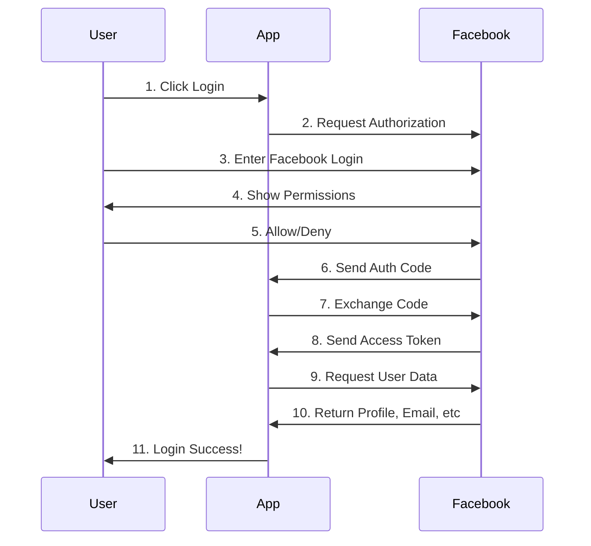

# 🌐 Facebook OAuth2 🔑 Guide

The `Facebook` provider lets you sign in 🔓 users using their Facebook accounts through OAuth2.



---

## 🔧 Facebook App Setup Guide

To use Facebook OAuth2 in your app, you need to set up a Facebook App. Here's a step-by-step guide to obtain the necessary credentials (`client_id`, `client_secret`, `redirect_uri`) and configure your app.

### Step 1: Create a Facebook Developer Account
1. Go to [Facebook for Developers](https://developers.facebook.com/).
2. Log in with your Facebook account or create one if you don't have it.
3. Click on **Get Started** to register as a developer.

### Step 2: Create a Facebook App
1. Once logged in, navigate to **My Apps** at the top right and click **Create App**.
2. Choose the **App Type** that fits your use case. For OAuth, choose **Consumer**.
3. Fill in the details like **App Name**, **Contact Email**, etc., and click **Create App ID**.

### Step 3: Set Up Facebook Login
1. After creating the app, navigate to **Add a Product** and select **Facebook Login**.
2. Choose **Web** and enter your website URL.

### Step 4: Configure OAuth Settings
1. Go to **Settings > Basic** to find your **App ID** (`client_id`) and **App Secret** (`client_secret`). Make sure to store these securely.
2. Under **Facebook Login > Settings**, add your `redirect_uri` under **Valid OAuth Redirect URIs**. This should match the redirect URL used in your code, e.g., `http://localhost:8000/facebook/callback`.

### Step 5: App Review and Permissions
1. **Permissions**: By default, only basic profile information is available. To access additional fields like email, you need to request specific permissions.
2. **App Review**: Some permissions (e.g., email) require **App Review**. Go to **App Review > Permissions and Features** and submit for review.
3. Ensure your app is in **Live** mode for production use. In **Development** mode, only users with roles (admin, developer, tester) can log in.

### Step 6: Store Credentials Securely
Add the following to your `.env` file:
```env
FACEBOOK_CLIENT_ID=your-facebook-client-id
FACEBOOK_CLIENT_SECRET=your-facebook-client-secret
FACEBOOK_REDIRECT_URI=http://localhost:8000/facebook/callback/
```
Use the `dotenv` package to load these variables in your Django project.


## 🚀 Getting Started

First, import the needed 📦 class and set up your Facebook App ⚙️ settings:

```python
from omni_authify.providers import Facebook

# Set up Facebook App settings (found in your Facebook Developer App's dashboard)
facebook_provider = Facebook(
    client_id='🔑 your-facebook-client-id', 
    client_secret='🔒 your-facebook-client-secret',
    redirect_uri='🌐 your-facebook-redirect-uri',
    scope='email,public_profile',
    fields='facebook-user-fields' # e.g: fields="id,name,email,picture,birthday"
)
```

> **⚠️ Note:** It's best to store your Facebook App settings in a `.env` file for 🔐 security. You can access them in `settings.py` using `python-dotenv` or `environ`.

**Example `.env` file:**
```env
FACEBOOK_CLIENT_ID=🔑 your-facebook-client-id
FACEBOOK_CLIENT_SECRET=🔒 your-facebook-client-secret
FACEBOOK_REDIRECT_URI=http://localhost:8000/facebook/callback/
```

## ⚙️ Updating Settings

Make sure that your `redirect_uri` matches the callback URL you set in your Facebook app settings and in your Django URLs.

---

## 📋 Methods

### 1. 🔗 Get Authorization URL
This method creates the link 🔗 you need to send the user to so they can log in using Facebook.

```python
def get_authorization_url(state=None):
    pass
```

**Parameters:**
- `state` (str, optional): A random string 🔀 to protect against cross-site request forgery attacks.

**Returns:**
- `str`: The URL 🌐 to use for Facebook login.

**Example:**
```python
auth_url = facebook_provider.get_authorization_url(state='random_state_string')
```

### 2. 🔓 Get Access Token
This method uses the code from Facebook to get an access token 🔑.

```python
def get_access_token(code):
    pass
```

**Parameters:**
- `code` (str): The authorization code 🔢 you got from the callback URL.

**Returns:**
- `str`: The access token 🔑.

**Example:**
```python
access_token = facebook_provider.get_access_token(code='authorization_code')
```

### 3. 📄 Get User Profile
This method gets the user's profile information from Facebook.

```python
def get_user_profile(access_token, fields="id,name,email,picture"):
    pass
```

**Parameters:**
- `access_token` (str): The access token 🔑 you got from `get_access_token`.
- `fields` (str, optional): A list of fields you want to get, separated by commas. Defaults to `"id,name,email,picture"`.

**Returns:**
- `dict`: The user's profile information 📋.

**Example:**
```python
user_info = facebook_provider.get_user_profile(access_token, fields="id,name,email,picture,birthday")
```

---

## 🛠️ Customizing Fields

You can choose which fields you want to get from the user's profile by changing the `fields` parameter.

For a comprehensive list of user profile fields and the necessary permissions, refer to the [Facebook Permissions Reference](https://developers.facebook.com/micro_site/url/?click_from_context_menu=true&country=UZ&destination=https%3A%2F%2Fdevelopers.facebook.com%2Fdocs%2Fpermissions%23u&event_type=click&last_nav_impression_id=0CKNP5lCbLobwYsLe&max_percent_page_viewed=77&max_viewport_height_px=820&max_viewport_width_px=1440&orig_http_referrer=https%3A%2F%2Fdevelopers.facebook.com%2Fdocs%2Fpermissions&orig_request_uri=https%3A%2F%2Fdevelopers.facebook.com%2Fajax%2Fpagelet%2Fgeneric.php%2FDeveloperNotificationsPayloadPagelet%3Ffb_dtsg_ag%3D--sanitized--%26data%3D%257B%2522businessUserID%2522%253Anull%252C%2522cursor%2522%253Anull%252C%2522length%2522%253A15%252C%2522clientRequestID%2522%253A%2522js_9v%2522%257D%26__usid%3D6-Tsnkqf2bcl65q%253APsnkqez1i8a76g%253A0-Asnkqf26ec5zg-RV%253D6%253AF%253D%26jazoest%3D25156&region=emea&scrolled=false&session_id=1HA5w7ppaJ4Pknves&site=developers).

**Example:**
```python
fields = "id,name,email,birthday"
user_info = facebook_provider.get_user_profile(access_token, fields=fields)
```

---

## ✅ Best Practices
- **🔒 Use Environment Variables:** Always use environment variables to store important information like `client_id` and `client_secret`. This helps keep your credentials safe 🛡️.
- **🔗 Match Redirect URI:** Make sure the `redirect_uri` is the same in both your Facebook App settings and your code to avoid errors 🚫 during the login process.
- **⚠️ Error Handling:** Handle any possible errors 🐞 during the login and token exchange process to ensure a smooth user experience 😊.

---

Now you're ready to use Facebook for authenticating users in your app 🚀. Follow these steps and best practices to make sure everything runs securely 🔐 and smoothly ✨.

