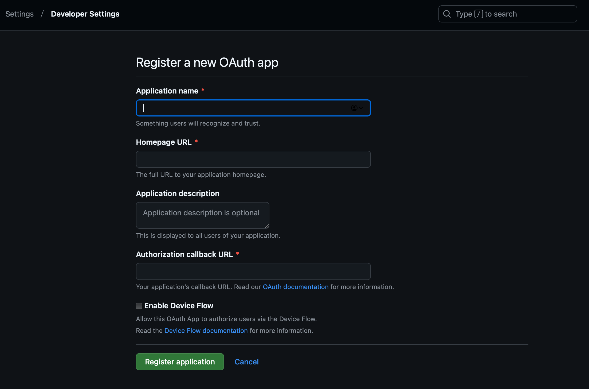
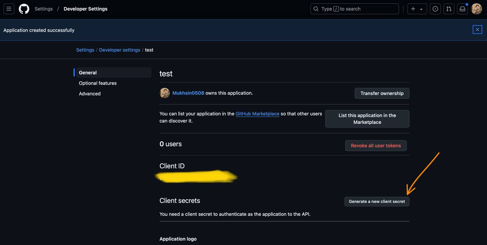
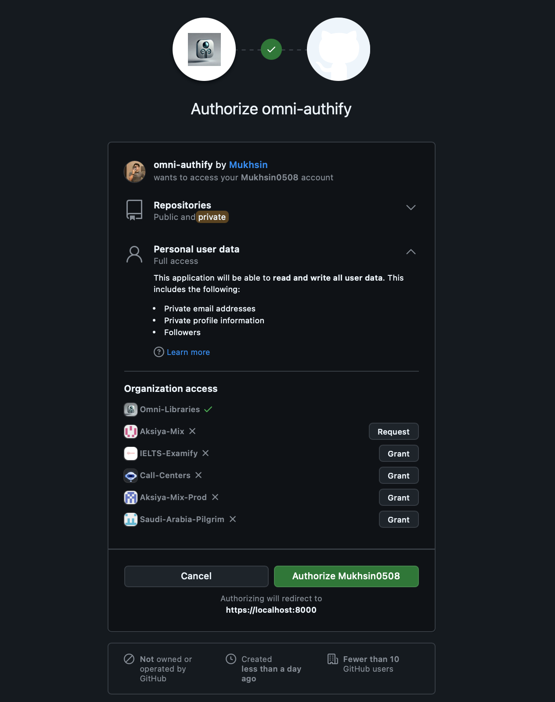

# 🌐 Github OAuth2 🔑 Guide

The `GitHub` provider lets you sign in 🔓 users using their GitHub accounts through OAuth2.

---

## 🔧 GitHub App Setup Guide

To use GitHub OAuth2 in your app, you need to set up a GitHub App. Here's a step-by-step guide to obtain the necessary 
credentials (`client_id`, `client_secret`, `redirect_uri`) and configure your app.

### Step 1: Register a new OAuth app
1. #### Log in with your GitHub account or create one if you don't have it.
2. #### Go to [GitHub Developer Settings](https://github.com/settings/applications/new).
3. #### Click on New OAuth app.
****

### Step 2: Configure OAuth Settings
1. #### Enter App name and Authorization callback URL
2. #### Press **Register**
****

### Step 3: Get Client_ID and Generate Client_Secret 
1. #### Copy the Client_ID
2. #### Press **Generate a new client secret**
****

### Step 4: Scopes for OAuth apps
#### Go get yourself familiarized with [Scopes](https://docs.github.com/en/apps/oauth-apps/building-oauth-apps/scopes-for-oauth-apps) first.
#### Mostly ```scope='user,repo'``` will be enough for authentication as it returns really a lot of data for you to work with. 

### Step 6: Store Credentials Securely

> **⚠️ Note:** It's best to store your GitHub App settings in a `.env` file for 🔐 security.
Add the following to your `.env` file:
```env
GITHUB_CLIENT_ID=your-client-id
GITHUB_CLIENT_SECRET=your-client-secret
GITHUB_REDIRECT_URI=https://localhost:8000/github/callback  #[//]: Change this to where you want Github to redirect the user after authentication
GITHUB_CLIENT_SCOPE="user,repo" # add other scope as you like
```
Use the `python-dotenv` package to load these variables in your Django project.


## 🚀 Getting Started

First, import the needed 📦 class and set up your GitHub App ⚙️ settings:

#### Note this way of using the library is not recommended!
#### Instead, refer to easy-way of GitHub Login setup for Django specific doc at **[here](../usage/django.md)**: 
```python
from omni_authify.providers import GitHub 

provider = GitHub(
    client_id='🔑 your-facebook-client-id', 
    client_secret='🔒 your-facebook-client-secret',
    redirect_uri='🌐 your-facebook-redirect-uri',
    scope="user,repo"
)
```

## ⚙️ Updating Settings

> **⚠️ Note:** Make sure that your `redirect_uri` matches the callback URL you set in your GitHub OAUTH2 app 
> settings and in your Django URLs.

---

## 📋 Methods

### 1. 🔗 Get Authorization URL
This method creates the link 🔗 you need to send the user to so they can log in using Facebook.

```python
def get_authorization_url(state=None):
    pass
```

**Parameters:**
- `state` (str, optional): A random string 🔀 to protect against cross-site request forgery attacks.

**Returns:**
- `str`: The URL 🌐 to use for GitHub login.

**Example:**
```python
auth_url = provider.get_authorization_url(state='random_state_string')
```

### 2. 🔓 Get Access Token
This method uses the code from GitHub to get an access token 🔑.

```python
def get_access_token(code):
    pass
```

**Parameters:**
- `code` (str): The authorization code 🔢 you got from the callback URL.

**Returns:**
- `str`: The access token 🔑.

**Example:**
```python
access_token = provider.get_access_token(code='authorization_code')
```

### 3. ** ⚙️ Check to which scope your GitHub Oauth2 app has access.**
```python
import os 
from dotenv import  load_dotenv

from omni_authify.providers.github import GitHub

load_dotenv()

github_client_id = os.getenv('GITHUB_CLIENT_ID')
github_client_secret = os.getenv('GITHUB_CLIENT_SECRET')
github_redirect_uri = os.getenv('GITHUB_REDIRECT_URI')
github_scope = os.getenv('GITHUB_SCOPE')

provider = GitHub(
    client_id=github_client_id,
    client_secret=github_client_secret,
    redirect_uri=github_redirect_uri,
    scope=scope
)

# ==== After obtaining an access token at Step 2 ====
scopes = provider.check_token_scopes(access_token)
print(scopes)
```

### 4. 📄 Get User Profile
This method gets the user's profile information from Facebook.

```python
def get_user_profile(access_token, fields="id,name,email,picture"):
    pass
```

**Parameters:**
- `access_token` (str): The access token 🔑 you got from `get_access_token`.

**Returns:**
- `dict`: The user's profile information 📋.

**Example:**
```python
user_info = provider.get_user_profile(access_token)
```

---

## 🛠️ Customizing Fields

For a comprehensive list of user profile fields and the necessary permissions, refer to the [GitHub Scope Reference](https://docs.github.com/en/apps/oauth-apps/building-oauth-apps/scopes-for-oauth-apps)

**Example:**
```python
user_info = provider.get_user_profile(access_token)
```

---

## ✅ Best Practices
- **🔒 Use Environment Variables:** Always use environment variables to store important information like `client_id` and `client_secret`. This helps keep your credentials safe 🛡️.
- **🔗 Match Redirect URI:** Make sure the `redirect_uri` is the same in both your GitHub App settings and your code to avoid errors 🚫 during the login process.
- **⚠️ Error Handling:** Handle any possible errors 🐞 during the login and token exchange process to ensure a smooth user experience 😊.

---

Now you're ready to use GitHub for authenticating users in your app 🚀. Follow these steps and best practices to make sure everything runs securely 🔐 and smoothly ✨.

### Final Result
****

