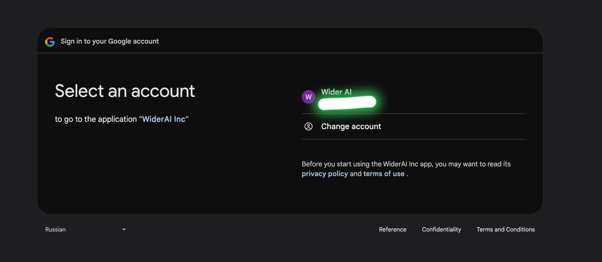

# 🌐 Google OAuth2 🔑 Guide

The `Google` provider lets you sign in 🔓 users using their Google accounts through OAuth2.

---
## Go to Resources
- **Start from here: [Using OAuth 2.0 to Access Google APIs](https://developers.google.com/identity/protocols/oauth2)**
- **For a comprehensive list of Google API scopes, refer to the official Google documentation: [OAuth 2.0 Scopes for Google APIs](https://developers.google.com/identity/protocols/oauth2/scopes)**
- **If your app's configuration has more than 10 domains, has a logo, or requests sensitive or restricted scopes, you will need to [submit for verification](https://support.google.com/cloud/answer/13463073?visit_id=638701880892240918-3305891983&rd=1)**

## Overview
The sequence diagram below illustrates the flow of obtaining and using an OAuth 2.0 token from Google to access Google APIs:


---

---

## 🔧 Google App Setup Guide

To use Google OAuth2 in your Django REST Framework app, you need to set up a Google App. Here's a step-by-step guide to obtain the necessary credentials (`client_id`, `client_secret`, `redirect_uri`) and configure your app.

### Step 1: Create a Google Developer Account
1. Go to [Google Cloud Console](https://console.cloud.google.com/).
2. Log in with your Google account or create one if you don't have it.

### Step 2: Create a Google Project
1. Click on **Select project**
2. Create a new project or select an existing one.

<p>
  
  
<p>
<p>
  
  
<p>

### Step 3: Create Google App
1. Click on the navigation menu in the top right corner.
2. Select **APIs & Services**.
3. Go to **OAuth consent screen** section.
4. Click on **CREATE**.
5. Fill in the required information and click on **SAVE AND CONTINUE** several times until the application is created.

<p>
  
  
<p>
<p>
  
  
<p>
   
<p>

### Step 4: Create Credentials
1. Go to the **Credentials** section.
2. Click on **CREATE CREDENTIALS** and select **OAuth client ID**.
3. Select the application type **Web Application** and fill in the required fields.
4. Add your `redirect_uri` under **Authorized redirect URIs**. This should match the redirect URL used in your code, e.g., `http://localhost:8000/google/callback`.
5. After you have filled in the required fields, click **CREATE**.
6. After you have created it, you should open a window with your Client ID and Client secret. Make sure to store these securely.

<p>
  
  
<p>
<p>
  
  
<p>
   
<p>

### Step 5: Publish your App
- **In order not to limit your Google Oauth2 app to only Test Users, you need to publish your app.**
- **Once you set your app status as "In production", your app will be available to anyone with a Google Account.**
<p>
  
</p>


### Step 6: Store Credentials Securely

> **⚠️ Note:** It's best to store your Google App settings in a `.env` file for 🔐 security. You can access them in `settings.py` using `python-dotenv` or `environ`.

**Add the following to your `.env` file:**
```env
GOOGLE_CLIENT_ID=80699544681-93cmkgnpqg8jfi52ipmkc01s8u43mkk5.apps.googleusercontent.com
GOOGLE_CLIENT_SECRET=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
GOOGLE_REDIRECT_URI=https://localhost:8000/google/callback
GOOGLE_SCOPES='openid profile email https://www.googleapis.com/auth/contacts.readonly' # Note: between scopes a leave whitespace
```
**Use the `dotenv` package to load these variables in your project.**


## 🚀 Getting Started
**First, import the needed 📦 class and set up your Google App ⚙️ settings:**

```python
from omni_authify.providers import Google

# Set up Google App settings (found in your Google Cloud App's dashboard)
google_provider = Google(
    client_id='🔑 your-google-client-id', 
    client_secret='🔒 your-google-client-secret',
    redirect_uri='🌐 your-google-redirect-uri',
    scope='openid profile email https://www.googleapis.com/auth/contacts.readonly'
)
```

## ⚙️ Updating Settings

Make sure that your `redirect_uri` matches the callback URL you set in your Google app settings and in your Django URLs.

---

## 📋 Methods

### 1. 🔗 Get Authorization URL
This method creates the link 🔗 you need to send the user to so they can log in using Google.

```python
def get_authorization_url(state=None):
    pass
```

**Parameters:**
- `state` (str, optional): A random string 🔀 to protect against cross-site request forgery attacks.

**Returns:**
- `str`: The URL 🌐 to use for Google login.

**Example:**
```python
auth_url = google_provider.get_authorization_url(state='random_state_string')
```

### 2. 🔓 Get Access Token
This method uses the code from GitHub to get an access token 🔑.

```python
def get_access_token(code):
    pass
```

**Parameters:**
- `code` (str): The authorization code 🔢 you got from the callback URL.

**Returns:**
- `str`: The access token 🔑.

**Example:**
```python
access_token = provider.get_access_token(code='authorization_code')
```

### 3. 📄 Get User Profile
This method gets the user's profile information from Google.

```python
def get_user_profile(access_token):
    pass
```


**Parameters:**
- `access_token` (str): The access token 🔑 you got from `request.GET`.

**Returns:**
- `dict`: The user's profile information 📋.

**Example:**
```python
user_info = google_provider.get_user_profile(access_token)
```

---

## 🛠️ Customizing Fields

You can choose which fields you want to get from the user's profile by changing the `scope` parameter.

Without changing it, you will receive an openid, profile and email address (everything that can be taken if your 
Google Cloud Project has enabled Google People API in the Google Cloud Console).

**Example:**
```python
scope = "openid email profile"
user_info = google_provider.get_authorization_url(scope=scope)
```

---

## ✅ Best Practices
- **🔒 Use Environment Variables:** Always use environment variables to store important information like `client_id` and `client_secret`. This helps keep your credentials safe 🛡️.
- **🔗 Match Redirect URI:** Make sure the `redirect_uri` is the same in both your Google App settings and your code to avoid errors 🚫 during the login process.
- **⚠️ Error Handling:** Handle any possible errors 🐞 during the login and token exchange process to ensure a smooth user experience 😊.

---

Now you're ready to use Google for authenticating users in your app 🚀. Follow these steps and best practices to make sure everything runs securely 🔐 and smoothly ✨.
### Final Result
<p>
  
  
<p>
   
<p>

