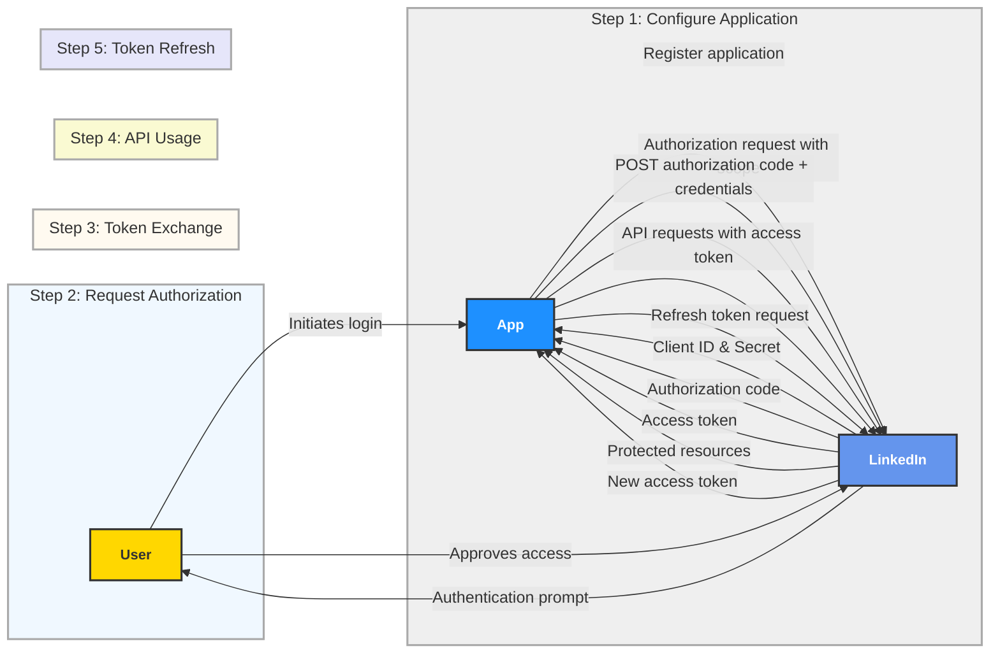
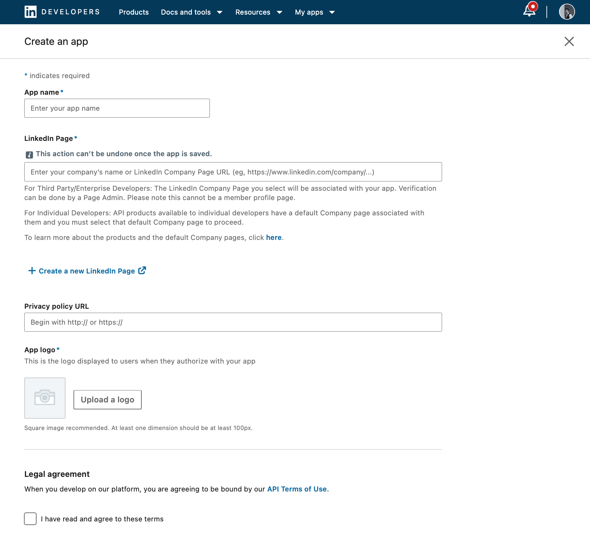
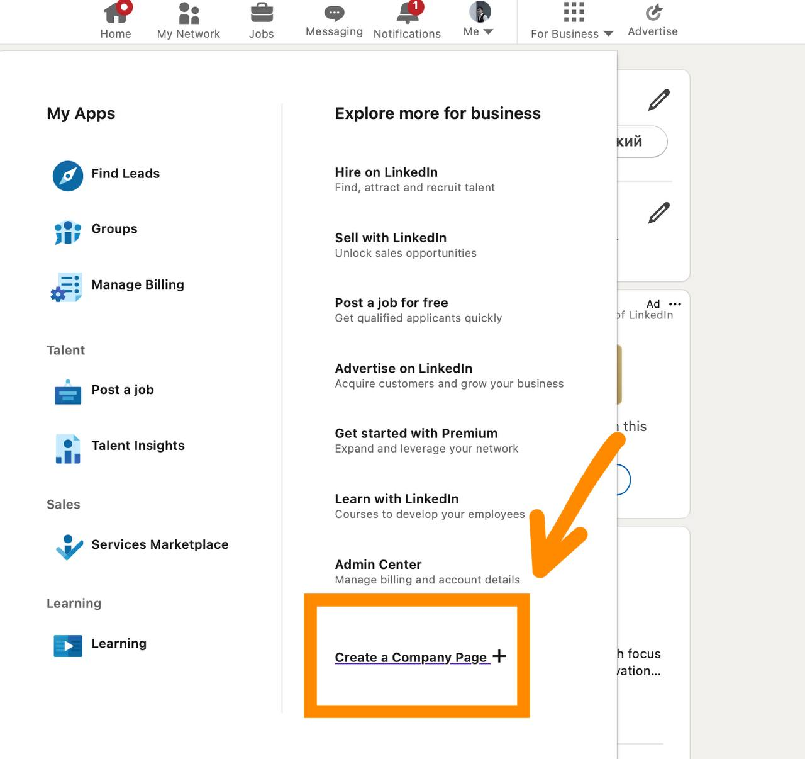
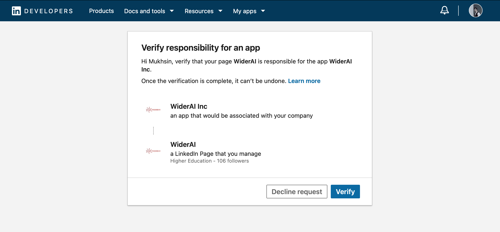
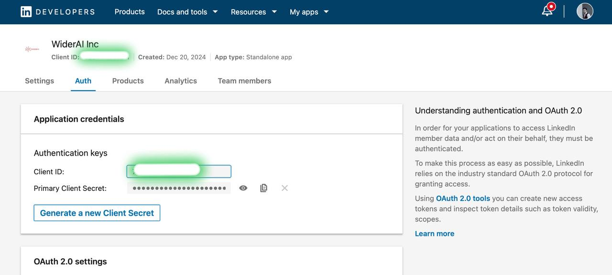
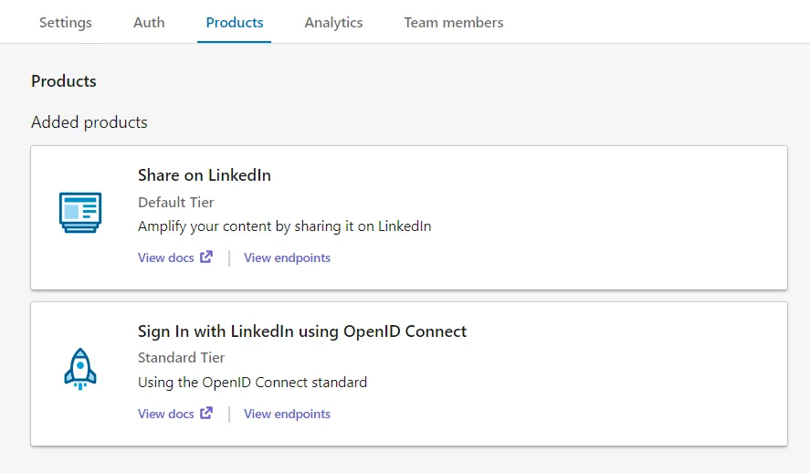
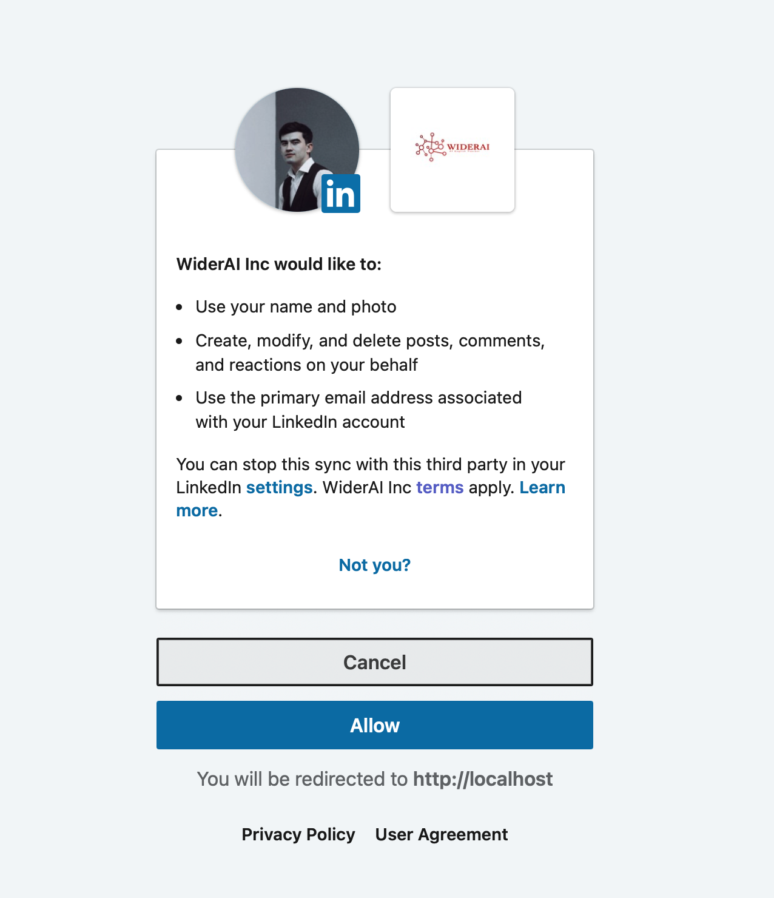
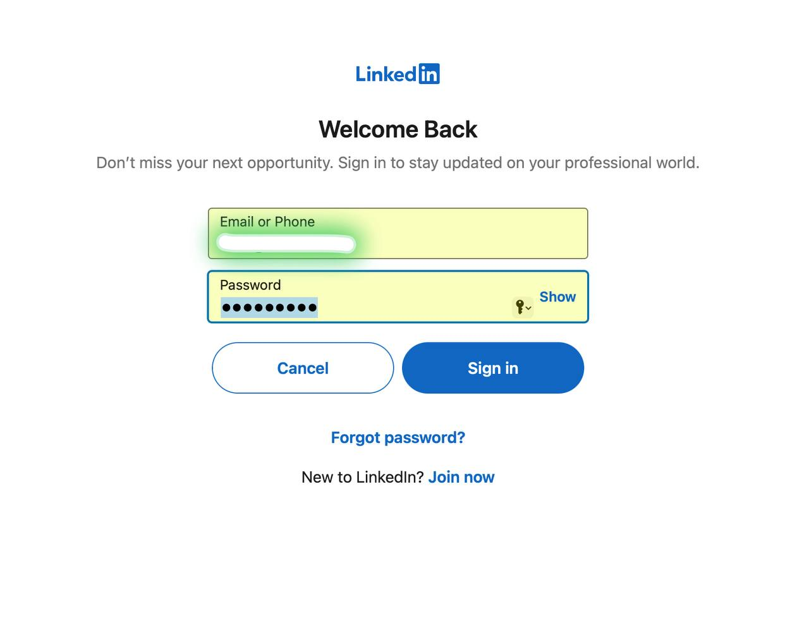

# 🌐 Linkedin OAuth2 🔑 Guide


---

## 🔄 Resources

- **[Learn OAuth 2.0 to Access LinkedIn APIs](https://learn.microsoft.com/en-us/linkedin/)**
- **[Sign in with LinkedIn using OpenID Connect](https://learn.microsoft.com/en-us/linkedin/consumer/integrations/self-serve/sign-in-with-linkedin-v2)**
- **[Share on LinkedIn](https://learn.microsoft.com/en-us/linkedin/consumer/integrations/self-serve/share-on-linkedin)**

---

## 🔧 LinkedIn OAuth2 App Setup Guide

### Step 1: Create a LinkedIn Developer Account
1. Go to [LinkedIn Developer Account](https://www.linkedin.com/developers/).
2. Log in with your LinkedIn account or create one if you don't have it.

### Step 2: Create a LinkedIn App
1. Click on **Create App**.
2. Fill in all basic details.
3. Associate your app with a company page (create one if you don’t have any).

<p>
  
  
</p>

### Step 3: Verify the LinkedIn App
1. Request app verification via the **Settings > Verify** button.
2. Paste the verification link into a new browser window.
3. Press **Verify**.

<p>
  
</p>

### Step 4: Client ID and Client Secret

- **Access Client ID and Secret** from the Auth tab in the developer dashboard.
- Go to the Products tab and request access to **Sign In with LinkedIn using OpenID Connect** and **Share on LinkedIn**.

<p>
  
  
  
</p>

> 🚨 **Important:** LinkedIn servers will only communicate with trusted URLs. Ensure your callback URL meets the following criteria:
>
> - Must be absolute: `https://example.com/auth/linkedin/callback`
> - Parameters are ignored: `https://example.com/auth/linkedin/callback?id=1` becomes `https://example.com/auth/linkedin/callback`
> - Cannot include a `#`: `https://example.com/auth/linkedin/callback#linkedin` is invalid.

### Step 6: Store Credentials Securely

> 🔒 **Tip:** Use a `.env` file for secure storage of credentials.

```env
LINKEDIN_CLIENT_ID='🔑 your-client-id'
LINKEDIN_CLIENT_SECRET='🔒 your-client-secret'
LINKEDIN_REDIRECT_URI='🌐 your-redirect-uri'
LINKEDIN_SCOPE=openid,profile,w_member_social,email
```

---

## 🚀 Getting Started

### Import LinkedIn Class and Configure Settings

```python
from omni_authify.providers import LinkedIn

linkedin_provider = LinkedIn(
    client_id='🔑 your-linkedin-client-id',
    client_secret='🔒 your-linkedin-client-secret',
    redirect_uri='🌐 your-linkedin-redirect-uri',
    scope='openid,profile,w_member_social,email'
)
```

Ensure your `redirect_uri` matches the callback URL in both LinkedIn app settings and Django URLs.

---

## 🗊 Methods

### 1. 🔗 Get Authorization URL
Generates the login URL for LinkedIn authentication.

```python
def get_authorization_url(state=None):
    pass
```

**Example:**
```python
auth_url = linkedin_provider.get_authorization_url(state='random_state_string')
```

### 2. 🔓 Get Access Token
Exchanges the authorization code for an access token.

```python
def get_access_token(code):
    pass
```

**Example:**
```python
access_token = linkedin_provider.get_access_token(code='authorization_code')
```

### 3. 🕴️ Get User Profile
Fetches the authenticated user’s profile data.

```python
def get_user_profile(access_token):
    pass
```

**Example:**
```python
user_info = linkedin_provider.get_user_profile(access_token)
```

---

## ✅ Best Practices

- **🔒 Secure Credentials:** Use environment variables to protect sensitive data.
- **🔗 Match Redirect URI:** Ensure consistency between LinkedIn app settings and your application code.
- **⚠️ Handle Errors Gracefully:** Implement error handling for a smooth user experience.

---

## 🎉 Final Result
<p>
  
  
</p>

